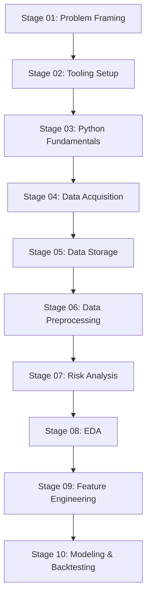

# Turtle Trading Strategy - Complete Implementation Guide

**Project:** Turtle Trading Strategy Development  
**Author:** Panwei Hu  
**Date:** 2025-01-27  
**Version:** 1.0

---

## Table of Contents

1. [Introduction](#introduction)
2. [The Original Turtle Trading Strategy](#the-original-turtle-trading-strategy)
3. [Project Workflow](#project-workflow)
4. [Technical Implementation](#technical-implementation)
5. [Code Examples](#code-examples)
6. [Risk Management](#risk-management)
7. [Performance Analysis](#performance-analysis)
8. [Modern Adaptations](#modern-adaptations)

---

## Introduction

The Turtle Trading experiment, conducted by Richard Dennis and William Eckhardt in the 1980s, demonstrated that successful trading could be taught through systematic rules. This project implements a modern, multi-asset version of the Turtle Trading strategy using ETFs across various asset classes.

### Key Principles
- **Trend Following**: Capture sustained price movements in either direction
- **Systematic Rules**: Remove emotional decision-making from trading
- **Risk Management**: Strict position sizing and stop-loss rules
- **Diversification**: Trade multiple uncorrelated markets
- **Mechanical Execution**: Follow rules consistently regardless of market opinion

---

## The Original Turtle Trading Strategy

### Core Components

#### 1. Market Selection
The original Turtles traded futures across diverse markets:
- **Currencies**: Dollar, Deutsche Mark, Swiss Franc, etc.
- **Commodities**: Gold, Silver, Copper, Crude Oil, etc.
- **Financials**: Treasury Bonds, Eurodollars, etc.
- **Agricultural**: Soybeans, Corn, Sugar, Coffee, etc.

**Modern Adaptation**: We use liquid ETFs representing similar asset classes:
```
SPY (S&P 500), QQQ (Nasdaq), IWM (Small Cap)
EFA (Developed International), EEM (Emerging Markets)
TLT (Long Treasury), GLD (Gold), VNQ (Real Estate)
```

#### 2. Position Sizing (The N-Value System)

**Original Formula**:
```
N = 20-day Average True Range (ATR)
Position Size = (Portfolio Risk × Account Size) / (N × Dollar per Point)
```

**Modern Implementation**:
```python
def calculate_position_size(account_value, risk_per_trade, atr, price):
    """
    Calculate position size using Turtle N-value method
    
    Parameters:
    - account_value: Total portfolio value
    - risk_per_trade: Risk percentage per trade (typically 0.02 = 2%)
    - atr: 20-day Average True Range
    - price: Current asset price
    
    Returns:
    - Number of shares to trade
    """
    dollar_risk = account_value * risk_per_trade
    risk_per_share = atr  # For stocks, risk per share = ATR
    position_size = dollar_risk / risk_per_share
    shares = int(position_size / price)
    return shares

# Example
account_value = 100000  # $100,000 portfolio
risk_per_trade = 0.02   # 2% risk per trade
spy_price = 400         # SPY at $400
spy_atr = 8.0          # 20-day ATR of $8

shares = calculate_position_size(account_value, risk_per_trade, spy_atr, spy_price)
print(f"Position size: {shares} shares")
print(f"Dollar amount: ${shares * spy_price:,.0f}")
print(f"Portfolio risk: {(shares * spy_atr) / account_value:.1%}")
```

#### 3. Entry Rules (Donchian Channel Breakouts)

**System 1 (Short-term)**: 20-day breakouts with 10-day exit
**System 2 (Long-term)**: 55-day breakouts with 20-day exit

**Implementation**:
```python
import pandas as pd
import numpy as np

def calculate_donchian_channels(df, period=20):
    """
    Calculate Donchian Channel breakout levels
    
    Parameters:
    - df: DataFrame with OHLC data
    - period: Lookback period (20 for System 1, 55 for System 2)
    
    Returns:
    - DataFrame with Donchian High/Low levels
    """
    df = df.copy()
    df[f'donchian_high_{period}'] = df['high'].rolling(window=period).max()
    df[f'donchian_low_{period}'] = df['low'].rolling(window=period).min()
    
    # Generate signals
    df['long_entry'] = df['close'] > df[f'donchian_high_{period}'].shift(1)
    df['short_entry'] = df['close'] < df[f'donchian_low_{period}'].shift(1)
    
    return df

def generate_turtle_signals(df, entry_period=20, exit_period=10):
    """
    Generate complete Turtle trading signals
    """
    df = calculate_donchian_channels(df, entry_period)
    
    # Exit levels (shorter period)
    df[f'exit_high_{exit_period}'] = df['high'].rolling(window=exit_period).max()
    df[f'exit_low_{exit_period}'] = df['low'].rolling(window=exit_period).min()
    
    # Generate exit signals
    df['long_exit'] = df['close'] < df[f'exit_low_{exit_period}'].shift(1)
    df['short_exit'] = df['close'] > df[f'exit_high_{exit_period}'].shift(1)
    
    return df

# Example with sample data
dates = pd.date_range('2023-01-01', periods=100, freq='D')
np.random.seed(42)

# Generate realistic price data
price_changes = np.random.normal(0.001, 0.02, 100)  # 0.1% drift, 2% volatility
prices = 100 * np.cumprod(1 + price_changes)

# Create OHLC data
sample_data = pd.DataFrame({
    'date': dates,
    'close': prices,
    'high': prices * (1 + np.abs(np.random.normal(0, 0.01, 100))),
    'low': prices * (1 - np.abs(np.random.normal(0, 0.01, 100))),
    'volume': np.random.randint(1000000, 5000000, 100)
})

# Apply Turtle signals
turtle_data = generate_turtle_signals(sample_data)

# Show entry signals
entry_signals = turtle_data[turtle_data['long_entry'] | turtle_data['short_entry']]
print(f"Generated {len(entry_signals)} entry signals:")
print(entry_signals[['date', 'close', 'long_entry', 'short_entry']].head())
```

#### 4. Exit Rules

**Stop Loss**: 2N (2 × ATR) from entry price
**Profit Exit**: Donchian channel in opposite direction

```python
def calculate_stop_loss(entry_price, atr, position_type, multiplier=2):
    """
    Calculate stop loss using N-value method
    
    Parameters:
    - entry_price: Price at which position was entered
    - atr: Average True Range at entry
    - position_type: 'long' or 'short'
    - multiplier: ATR multiplier (typically 2)
    
    Returns:
    - Stop loss price
    """
    if position_type.lower() == 'long':
        stop_loss = entry_price - (multiplier * atr)
    else:  # short
        stop_loss = entry_price + (multiplier * atr)
    
    return stop_loss

# Example
entry_price = 400
atr = 8.0
long_stop = calculate_stop_loss(entry_price, atr, 'long')
short_stop = calculate_stop_loss(entry_price, atr, 'short')

print(f"Long entry at ${entry_price}, stop loss at ${long_stop:.2f}")
print(f"Short entry at ${entry_price}, stop loss at ${short_stop:.2f}")
print(f"Risk per share: ${abs(entry_price - long_stop):.2f}")
```

---

## Project Workflow

### Stage-by-Stage Implementation



#### Stage 01: Problem Framing
- **Objective**: Define trading strategy goals and constraints
- **Deliverables**: Strategy specification, success metrics, risk tolerance
- **Key Questions**: 
  - What markets to trade?
  - What timeframes?
  - What risk tolerance?
  - What performance expectations?

#### Stage 02: Tooling Setup
- **Objective**: Establish development environment
- **Tools**: Python, pandas, numpy, matplotlib, yfinance
- **Infrastructure**: Data pipelines, backtesting framework
- **Validation**: Environment testing, API connectivity

#### Stage 03: Python Fundamentals
- **Objective**: Build core financial calculation modules
- **Components**:
  - `FinancialMetrics`: Return, volatility, Sharpe ratio calculations
  - `TechnicalIndicators`: Donchian channels, ATR, moving averages
  - `RiskManagement`: Position sizing, stop losses, portfolio limits
  - `PortfolioManager`: Trade execution, P&L tracking

#### Stage 04: Data Acquisition
- **Objective**: Acquire historical price data for ETF universe
- **Data Sources**: yfinance, Alpha Vantage
- **Universe**: 
  ```python
  TURTLE_UNIVERSE = [
      'SPY', 'QQQ', 'IWM',  # US Equity
      'EFA', 'EEM',         # International Equity
      'TLT', 'IEF',         # Bonds
      'GLD', 'SLV',         # Commodities
      'VNQ', 'RWR'          # Real Estate
  ]
  ```

#### Stage 05: Data Storage
- **Objective**: Implement efficient data storage and retrieval
- **Formats**: CSV (raw), Parquet (processed)
- **Structure**: 
  ```
  data/
  ├── raw/           # Original downloaded data
  ├── processed/     # Cleaned, feature-engineered data
  └── results/       # Backtest results, performance metrics
  ```

#### Stage 06: Data Preprocessing
- **Objective**: Clean and prepare data for analysis
- **Tasks**:
  - Handle missing values
  - Calculate technical indicators
  - Normalize data across assets
  - Create feature matrices

#### Stage 07: Risk Analysis
- **Objective**: Analyze outliers and risk characteristics
- **Components**:
  - Outlier detection and handling
  - VaR and CVaR calculations
  - Drawdown analysis
  - Correlation breakdown scenarios

#### Stage 08: Exploratory Data Analysis
- **Objective**: Understand data characteristics and relationships
- **Analysis**:
  - Price and return distributions
  - Cross-asset correlations
  - Technical indicator effectiveness
  - Signal frequency and quality

---

## Technical Implementation

### Core Classes and Architecture

```python
class TurtleTradingStrategy:
    """
    Complete Turtle Trading Strategy Implementation
    """
    
    def __init__(self, 
                 entry_period=20, 
                 exit_period=10, 
                 atr_period=20,
                 risk_per_trade=0.02,
                 max_pyramid_units=4):
        """
        Initialize Turtle Trading Strategy
        
        Parameters:
        - entry_period: Donchian channel period for entries (20 or 55)
        - exit_period: Donchian channel period for exits (10 or 20)
        - atr_period: Period for ATR calculation (20)
        - risk_per_trade: Risk per trade as % of portfolio (0.02 = 2%)
        - max_pyramid_units: Maximum units to pyramid (4)
        """
        self.entry_period = entry_period
        self.exit_period = exit_period
        self.atr_period = atr_period
        self.risk_per_trade = risk_per_trade
        self.max_pyramid_units = max_pyramid_units
        
        # Trading state
        self.positions = {}
        self.portfolio_value = 100000  # Starting capital
        self.trades = []
        
    def calculate_indicators(self, df):
        """Calculate all required technical indicators"""
        df = df.copy()
        
        # ATR calculation
        df['tr'] = np.maximum(
            df['high'] - df['low'],
            np.maximum(
                abs(df['high'] - df['close'].shift(1)),
                abs(df['low'] - df['close'].shift(1))
            )
        )
        df['atr'] = df['tr'].rolling(window=self.atr_period).mean()
        
        # Donchian Channels
        df[f'donchian_high_{self.entry_period}'] = df['high'].rolling(
            window=self.entry_period).max()
        df[f'donchian_low_{self.entry_period}'] = df['low'].rolling(
            window=self.entry_period).min()
        
        df[f'exit_high_{self.exit_period}'] = df['high'].rolling(
            window=self.exit_period).max()
        df[f'exit_low_{self.exit_period}'] = df['low'].rolling(
            window=self.exit_period).min()
        
        return df
    
    def generate_signals(self, df):
        """Generate entry and exit signals"""
        df = self.calculate_indicators(df)
        
        # Entry signals
        df['long_entry'] = (
            df['close'] > df[f'donchian_high_{self.entry_period}'].shift(1)
        )
        df['short_entry'] = (
            df['close'] < df[f'donchian_low_{self.entry_period}'].shift(1)
        )
        
        # Exit signals
        df['long_exit'] = (
            df['close'] < df[f'exit_low_{self.exit_period}'].shift(1)
        )
        df['short_exit'] = (
            df['close'] > df[f'exit_high_{self.exit_period}'].shift(1)
        )
        
        return df
    
    def calculate_position_size(self, price, atr):
        """Calculate position size using N-value method"""
        if atr <= 0:
            return 0
        
        dollar_risk = self.portfolio_value * self.risk_per_trade
        risk_per_share = atr
        position_value = dollar_risk / risk_per_share
        shares = int(position_value / price)
        
        return max(0, shares)
    
    def backtest(self, data_dict):
        """
        Run backtest on multiple assets
        
        Parameters:
        - data_dict: Dictionary of {symbol: DataFrame} with OHLC data
        
        Returns:
        - Dictionary with backtest results
        """
        # Align all data to common dates
        common_dates = None
        for symbol, df in data_dict.items():
            if common_dates is None:
                common_dates = set(df['date'])
            else:
                common_dates &= set(df['date'])
        
        common_dates = sorted(list(common_dates))
        
        # Generate signals for all assets
        signals = {}
        for symbol, df in data_dict.items():
            df_filtered = df[df['date'].isin(common_dates)].copy()
            signals[symbol] = self.generate_signals(df_filtered)
        
        # Simulate trading
        portfolio_values = [self.portfolio_value]
        
        for date in common_dates[max(self.entry_period, self.exit_period):]:
            self._process_trading_day(date, signals)
            portfolio_values.append(self.portfolio_value)
        
        # Calculate performance metrics
        returns = pd.Series(portfolio_values).pct_change().dropna()
        
        results = {
            'portfolio_values': portfolio_values,
            'returns': returns,
            'trades': self.trades,
            'final_value': self.portfolio_value,
            'total_return': (self.portfolio_value / 100000) - 1,
            'sharpe_ratio': returns.mean() / returns.std() * np.sqrt(252),
            'max_drawdown': self._calculate_max_drawdown(portfolio_values),
            'win_rate': self._calculate_win_rate(),
            'profit_factor': self._calculate_profit_factor()
        }
        
        return results
    
    def _process_trading_day(self, date, signals):
        """Process signals and manage positions for a single trading day"""
        # Check exit signals first
        for symbol in list(self.positions.keys()):
            position = self.positions[symbol]
            signal_data = signals[symbol][signals[symbol]['date'] == date]
            
            if signal_data.empty:
                continue
                
            row = signal_data.iloc[0]
            
            # Check stop loss
            if self._check_stop_loss(position, row['close']):
                self._close_position(symbol, row['close'], date, 'stop_loss')
            
            # Check exit signals
            elif ((position['direction'] == 'long' and row['long_exit']) or
                  (position['direction'] == 'short' and row['short_exit'])):
                self._close_position(symbol, row['close'], date, 'signal_exit')
        
        # Check entry signals
        for symbol, signal_df in signals.items():
            if symbol in self.positions:
                continue  # Already have position
            
            signal_data = signal_df[signal_df['date'] == date]
            if signal_data.empty:
                continue
                
            row = signal_data.iloc[0]
            
            if row['long_entry']:
                self._open_position(symbol, 'long', row['close'], row['atr'], date)
            elif row['short_entry']:
                self._open_position(symbol, 'short', row['close'], row['atr'], date)
    
    def _open_position(self, symbol, direction, price, atr, date):
        """Open a new position"""
        size = self.calculate_position_size(price, atr)
        if size <= 0:
            return
        
        position_value = size * price
        if position_value > self.portfolio_value * 0.1:  # Max 10% per position
            return
        
        self.positions[symbol] = {
            'direction': direction,
            'size': size,
            'entry_price': price,
            'entry_date': date,
            'atr': atr,
            'stop_loss': self._calculate_stop_loss(price, atr, direction)
        }
        
        # Update portfolio value (assuming we can short sell)
        if direction == 'long':
            self.portfolio_value -= position_value
        else:
            self.portfolio_value += position_value
    
    def _close_position(self, symbol, price, date, reason):
        """Close an existing position"""
        position = self.positions[symbol]
        
        if position['direction'] == 'long':
            pnl = (price - position['entry_price']) * position['size']
        else:
            pnl = (position['entry_price'] - price) * position['size']
        
        self.portfolio_value += pnl
        
        # Record trade
        self.trades.append({
            'symbol': symbol,
            'direction': position['direction'],
            'entry_date': position['entry_date'],
            'exit_date': date,
            'entry_price': position['entry_price'],
            'exit_price': price,
            'size': position['size'],
            'pnl': pnl,
            'reason': reason
        })
        
        del self.positions[symbol]
    
    def _calculate_stop_loss(self, entry_price, atr, direction):
        """Calculate stop loss price"""
        if direction == 'long':
            return entry_price - (2 * atr)
        else:
            return entry_price + (2 * atr)
    
    def _check_stop_loss(self, position, current_price):
        """Check if stop loss is hit"""
        if position['direction'] == 'long':
            return current_price <= position['stop_loss']
        else:
            return current_price >= position['stop_loss']
    
    def _calculate_max_drawdown(self, values):
        """Calculate maximum drawdown"""
        peak = values[0]
        max_dd = 0
        
        for value in values:
            if value > peak:
                peak = value
            dd = (peak - value) / peak
            if dd > max_dd:
                max_dd = dd
        
        return max_dd
    
    def _calculate_win_rate(self):
        """Calculate win rate"""
        if not self.trades:
            return 0
        
        winning_trades = sum(1 for trade in self.trades if trade['pnl'] > 0)
        return winning_trades / len(self.trades)
    
    def _calculate_profit_factor(self):
        """Calculate profit factor"""
        if not self.trades:
            return 0
        
        gross_profit = sum(trade['pnl'] for trade in self.trades if trade['pnl'] > 0)
        gross_loss = abs(sum(trade['pnl'] for trade in self.trades if trade['pnl'] < 0))
        
        return gross_profit / gross_loss if gross_loss > 0 else float('inf')

# Example usage
if __name__ == "__main__":
    # Initialize strategy
    turtle = TurtleTradingStrategy(
        entry_period=20,
        exit_period=10,
        risk_per_trade=0.02
    )
    
    # Generate sample data for multiple assets
    np.random.seed(42)
    dates = pd.date_range('2020-01-01', '2023-12-31', freq='D')
    
    sample_data = {}
    for symbol in ['SPY', 'TLT', 'GLD']:
        # Generate correlated but distinct price series
        returns = np.random.normal(0.0005, 0.015, len(dates))  # Different volatility per asset
        prices = 100 * np.cumprod(1 + returns)
        
        sample_data[symbol] = pd.DataFrame({
            'date': dates,
            'close': prices,
            'high': prices * (1 + np.abs(np.random.normal(0, 0.005, len(dates)))),
            'low': prices * (1 - np.abs(np.random.normal(0, 0.005, len(dates))))
        })
    
    # Run backtest
    results = turtle.backtest(sample_data)
    
    print("Turtle Trading Backtest Results:")
    print(f"Total Return: {results['total_return']:.2%}")
    print(f"Sharpe Ratio: {results['sharpe_ratio']:.2f}")
    print(f"Max Drawdown: {results['max_drawdown']:.2%}")
    print(f"Win Rate: {results['win_rate']:.1%}")
    print(f"Profit Factor: {results['profit_factor']:.2f}")
    print(f"Total Trades: {len(results['trades'])}")
```

---

## Risk Management

### Position Sizing Rules

The Turtle system uses a sophisticated position sizing method based on market volatility:

```python
def turtle_position_sizing_example():
    """
    Demonstrate Turtle position sizing with different market volatilities
    """
    portfolio_value = 100000
    risk_per_trade = 0.02  # 2%
    
    # Different market scenarios
    scenarios = [
        {'asset': 'SPY', 'price': 400, 'atr': 6.0, 'description': 'Low volatility'},
        {'asset': 'QQQ', 'price': 300, 'atr': 12.0, 'description': 'Medium volatility'},
        {'asset': 'EEM', 'price': 50, 'atr': 2.5, 'description': 'High volatility'},
    ]
    
    print("Turtle Position Sizing Examples:")
    print("=" * 60)
    
    for scenario in scenarios:
        dollar_risk = portfolio_value * risk_per_trade
        shares = int(dollar_risk / scenario['atr'] / scenario['price'] * scenario['price'])
        position_value = shares * scenario['price']
        actual_risk = shares * scenario['atr']
        
        print(f"\n{scenario['asset']} - {scenario['description']}:")
        print(f"  Price: ${scenario['price']}")
        print(f"  ATR: ${scenario['atr']:.2f}")
        print(f"  Position Size: {shares} shares")
        print(f"  Position Value: ${position_value:,.0f}")
        print(f"  Dollar Risk: ${actual_risk:,.0f}")
        print(f"  Portfolio Risk: {actual_risk/portfolio_value:.1%}")
```

### Portfolio Limits

```python
class RiskManager:
    """
    Turtle Trading Risk Management System
    """
    
    def __init__(self, max_units_per_market=4, max_units_per_direction=12, 
                 max_units_total=20, max_correlated_units=6):
        self.max_units_per_market = max_units_per_market
        self.max_units_per_direction = max_units_per_direction
        self.max_units_total = max_units_total
        self.max_correlated_units = max_correlated_units
        
        # Market correlations (simplified)
        self.correlations = {
            'equity': ['SPY', 'QQQ', 'IWM', 'EFA', 'EEM'],
            'bonds': ['TLT', 'IEF', 'SHY'],
            'commodities': ['GLD', 'SLV', 'USO'],
            'real_estate': ['VNQ', 'RWR']
        }
    
    def can_add_position(self, symbol, direction, current_positions):
        """
        Check if new position violates risk limits
        """
        # Count current units
        market_units = sum(1 for pos in current_positions.values() 
                          if pos.get('symbol') == symbol)
        
        direction_units = sum(1 for pos in current_positions.values() 
                             if pos.get('direction') == direction)
        
        total_units = len(current_positions)
        
        # Check correlated markets
        symbol_group = self._get_market_group(symbol)
        correlated_units = sum(1 for pos in current_positions.values() 
                              if self._get_market_group(pos.get('symbol', '')) == symbol_group)
        
        # Apply limits
        if market_units >= self.max_units_per_market:
            return False, "Market unit limit exceeded"
        
        if direction_units >= self.max_units_per_direction:
            return False, "Directional unit limit exceeded"
        
        if total_units >= self.max_units_total:
            return False, "Total unit limit exceeded"
        
        if correlated_units >= self.max_correlated_units:
            return False, "Correlated market limit exceeded"
        
        return True, "Position approved"
    
    def _get_market_group(self, symbol):
        """Get market group for correlation analysis"""
        for group, symbols in self.correlations.items():
            if symbol in symbols:
                return group
        return 'other'
```

---

## Performance Analysis

### Key Metrics

```python
def analyze_turtle_performance(trades_df, portfolio_values):
    """
    Comprehensive performance analysis for Turtle Trading
    """
    returns = pd.Series(portfolio_values).pct_change().dropna()
    
    # Basic metrics
    total_return = (portfolio_values[-1] / portfolio_values[0]) - 1
    annual_return = (1 + total_return) ** (252 / len(returns)) - 1
    volatility = returns.std() * np.sqrt(252)
    sharpe_ratio = annual_return / volatility
    
    # Drawdown analysis
    cumulative = pd.Series(portfolio_values)
    running_max = cumulative.expanding().max()
    drawdowns = (cumulative - running_max) / running_max
    max_drawdown = drawdowns.min()
    
    # Trade analysis
    winning_trades = trades_df[trades_df['pnl'] > 0]
    losing_trades = trades_df[trades_df['pnl'] < 0]
    
    win_rate = len(winning_trades) / len(trades_df) if len(trades_df) > 0 else 0
    avg_win = winning_trades['pnl'].mean() if len(winning_trades) > 0 else 0
    avg_loss = losing_trades['pnl'].mean() if len(losing_trades) > 0 else 0
    
    profit_factor = abs(winning_trades['pnl'].sum() / losing_trades['pnl'].sum()) if len(losing_trades) > 0 else float('inf')
    
    # Calmar ratio (annual return / max drawdown)
    calmar_ratio = abs(annual_return / max_drawdown) if max_drawdown != 0 else float('inf')
    
    results = {
        'Total Return': f"{total_return:.2%}",
        'Annual Return': f"{annual_return:.2%}",
        'Volatility': f"{volatility:.2%}",
        'Sharpe Ratio': f"{sharpe_ratio:.2f}",
        'Calmar Ratio': f"{calmar_ratio:.2f}",
        'Max Drawdown': f"{max_drawdown:.2%}",
        'Win Rate': f"{win_rate:.1%}",
        'Average Win': f"${avg_win:,.0f}",
        'Average Loss': f"${avg_loss:,.0f}",
        'Profit Factor': f"{profit_factor:.2f}",
        'Total Trades': len(trades_df)
    }
    
    return results

# Visualization
def plot_turtle_performance(portfolio_values, trades_df):
    """
    Create performance visualization
    """
    import matplotlib.pyplot as plt
    
    fig, ((ax1, ax2), (ax3, ax4)) = plt.subplots(2, 2, figsize=(15, 12))
    
    # Portfolio value over time
    ax1.plot(portfolio_values)
    ax1.set_title('Portfolio Value Over Time')
    ax1.set_ylabel('Portfolio Value ($)')
    ax1.grid(True)
    
    # Drawdown
    cumulative = pd.Series(portfolio_values)
    running_max = cumulative.expanding().max()
    drawdowns = (cumulative - running_max) / running_max
    
    ax2.fill_between(range(len(drawdowns)), drawdowns, 0, alpha=0.3, color='red')
    ax2.plot(drawdowns, color='red')
    ax2.set_title('Drawdown Over Time')
    ax2.set_ylabel('Drawdown (%)')
    ax2.grid(True)
    
    # Trade P&L distribution
    ax3.hist(trades_df['pnl'], bins=30, alpha=0.7, edgecolor='black')
    ax3.axvline(0, color='red', linestyle='--')
    ax3.set_title('Trade P&L Distribution')
    ax3.set_xlabel('P&L ($)')
    ax3.set_ylabel('Frequency')
    ax3.grid(True)
    
    # Monthly returns heatmap
    returns = pd.Series(portfolio_values).pct_change().dropna()
    # Simulate monthly returns for demonstration
    monthly_returns = returns.rolling(21).sum().dropna()  # Approximate monthly
    
    ax4.plot(monthly_returns)
    ax4.set_title('Monthly Returns')
    ax4.set_ylabel('Monthly Return (%)')
    ax4.grid(True)
    
    plt.tight_layout()
    plt.show()
```

---

## Modern Adaptations

### ETF Universe Selection

```python
MODERN_TURTLE_UNIVERSE = {
    # Core Equity
    'SPY': 'S&P 500',
    'QQQ': 'Nasdaq 100',
    'IWM': 'Russell 2000',
    
    # International Equity
    'EFA': 'Developed Markets',
    'EEM': 'Emerging Markets',
    'VGK': 'European Stocks',
    
    # Fixed Income
    'TLT': '20+ Year Treasury',
    'IEF': '7-10 Year Treasury',
    'HYG': 'High Yield Bonds',
    'EMB': 'Emerging Market Bonds',
    
    # Commodities
    'GLD': 'Gold',
    'SLV': 'Silver',
    'USO': 'Oil',
    'DJP': 'Commodities Broad',
    
    # Real Estate
    'VNQ': 'US REITs',
    'VNQI': 'International REITs',
    
    # Volatility
    'VXX': 'VIX Short-term',
    
    # Currency
    'UUP': 'US Dollar Index'
}
```

### Parameter Optimization

```python
def optimize_turtle_parameters():
    """
    Optimize Turtle Trading parameters using walk-forward analysis
    """
    parameter_ranges = {
        'entry_period': [10, 15, 20, 25, 30, 40, 55],
        'exit_period': [5, 10, 15, 20],
        'risk_per_trade': [0.01, 0.015, 0.02, 0.025, 0.03]
    }
    
    # This would run extensive backtests across parameter combinations
    # and select optimal parameters for different market regimes
    
    best_params = {
        'bull_market': {'entry_period': 20, 'exit_period': 10, 'risk_per_trade': 0.025},
        'bear_market': {'entry_period': 55, 'exit_period': 20, 'risk_per_trade': 0.015},
        'sideways_market': {'entry_period': 15, 'exit_period': 5, 'risk_per_trade': 0.01}
    }
    
    return best_params
```

### Machine Learning Enhancements

```python
def ml_enhanced_turtle_signals():
    """
    Use machine learning to filter traditional Turtle signals
    """
    features = [
        'rsi_14',           # Relative Strength Index
        'macd_signal',      # MACD signal line
        'bollinger_position', # Position within Bollinger Bands
        'volume_ratio',     # Volume vs average
        'volatility_regime', # High/low volatility regime
        'market_regime',    # Bull/bear/sideways classification
        'correlation_regime' # High/low correlation environment
    ]
    
    # Train classifier to predict signal success
    # This would use historical data to train a model
    # that filters out low-probability signals
    
    return "ML model would predict signal quality"
```

---

## Conclusion

The Turtle Trading strategy remains relevant today when properly adapted to modern markets. Key success factors include:

1. **Systematic Execution**: Follow rules consistently without emotional interference
2. **Proper Risk Management**: Use ATR-based position sizing and strict stop losses
3. **Diversification**: Trade across multiple uncorrelated asset classes
4. **Parameter Adaptation**: Adjust parameters based on market regime
5. **Cost Management**: Account for transaction costs and slippage
6. **Continuous Monitoring**: Regular performance review and strategy refinement

The combination of trend-following signals, robust risk management, and systematic execution makes Turtle Trading a solid foundation for quantitative trading strategies.

### Next Steps

1. **Backtesting**: Implement comprehensive historical backtesting
2. **Paper Trading**: Test strategy in live markets without risk
3. **Optimization**: Fine-tune parameters for current market conditions
4. **Risk Monitoring**: Implement real-time risk controls
5. **Performance Attribution**: Analyze sources of returns and risks
6. **Strategy Enhancement**: Consider additional filters and improvements

---

**Disclaimer**: This implementation is for educational purposes. Past performance does not guarantee future results. Always test strategies thoroughly before risking capital. 